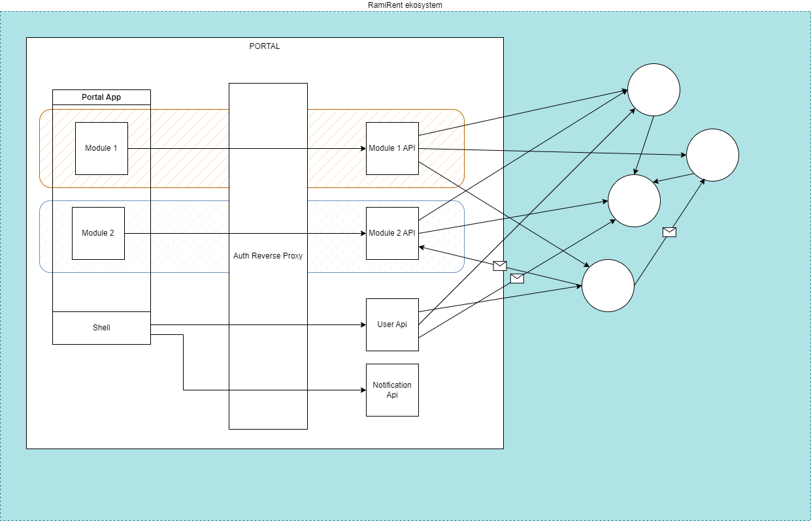

# TODO

## User authentication

- Sätta upp Azure AD B2C (finns redan på spinit)
- Koppla ett multitenant Azure AD som idp till detta B2C-adt (eller kan man koppla multipla single-tenant adn?)
- Registrera aktuella appar i adt.
- Skapa en reverse proxy med ngn cookie-baserad auth
- Skapa ett "modulapi" med någon annan auth som reverseproxyn översätter till
- React-front login
- Få vår react-front end att kunna hämta skyddad data från modul-apiet genom proxyn
- Diskussion kring hur vi hanterar att inte vem som helst kan logga in i tillfälle multi-tenant ad.
- Utbildning kring scopes / claims

## Build pipelines

## Azure environments

## User authorization (Users, Roles, Features and User Dimensions (WIP))

- `Users` are defined outside the portal framework. Identity Provider is probably Azure B2C (?). Users are from within the portal referenced by id (I think azure calls it objid). Some basic information can probably be denormalized (copied over) from azure, like name and email.
- `Roles` are defined in a user management module (which lives inside the portal)
- `Features` are exposed by `modules` (even the user management module might expose features, but some must be "hardcoded" to ensure you cannot kick yourself out of the user management module)
  - ? Shouldn't it be called "permission" rather than "feature"? I'm not so sure. A feature describes a module capability. A permission is a relation between a user and a feature. Thats why I think `feature` is the better word here.
- The `user management module` will give `user managers` the possibility to assign
  `features` to `roles`, and `roles` to `user`. I see no reason why a user can't have multiple roles. Features available for a user is _the union of the feature sets of the assigned roles_.
- As a bonus side effect, `Features` could be turned on and off directly in the portal. With this functionality we can quickly take down malfunctioning code and also leverage runtime switchable feature-flag capability (which is also an important component of trunk-based development, if we go down that route.)
- Some `features` dosnt make sense without some further context. This context is user specific and can be provided through `user dimensions`. In addition to `features`, each `module` can expose a set of module specific `user dimensions`. (In the context of a `user`, it could be called `module dimensions` instead). These `user dimensions` acts like extensions on the user object, and can be managed through the `user management module`. As an example, a typical `user dimension` of the `RamiConnect`-module, could be `"projects"`. For each user, you can use this dimension to extend the user object with a set of `project`s. These user projects can then be used in conjunction with a `"Parameterized" feature` to determine _which_ project(s) this `feature` is enabled for, for the given user.

- ?: Do we need the capability to quickly add a feature to a user, without doing it transitively through a role? There are multiple ways to do this, with different pros and cons.
  - Add a relation between user and feature, or
  - Create an implicit user specific role, or
  - Add a role-extension to the user, which can override any role configuration

## Notifications

## Dashboard and widgets

## default language

## module api

## docker files for local development?

## impersonering

# What is this repo?

This repo is intended to showcase portal features, provide documentation, reference modules and more.

It is also an environment where new portal features can be spiked, tested and documented.

## Reference module

My-module-app(sic!) is an external built module without any folder or workspace dependencies in this monorepo. This app was created externally and copied to this monorepo. To be able to be used as an Module the shell project was published with `npm pack` and included as an devDependency in my-module-app. My-module-app(sic!) was also published with `npm pack` and set as dependecy in portal-app.

# Portal basics

The portal allows different applications to execute within a shared context.
The shared context can provide user login, a notification system, a shared dashboard view, user management, navigation between applications and language features.

## Frontend components

The frontend executes as one single react app.

### Shell

The shell is the context that the portal provides. It is built as typescript library and provides no runtime on its own.
It provides the IModule typescript interface.

### Modules

A module is an app that lives inside the Shell. All modules are completely isolated from each other, and have no knowledge of other modules. Modules implement the IModule interface which will inform the shell about various properties, like its name, some menu item label, the widgets it expose etc. A module will receive read-only props from the shell, like the current user, for example.

### App

This is the runtime. It bundles 0-\* modules with the shell. The end product will only contain one app, called "portal". However, for developer convenience, we might have multiple apps containing only the modules you currently work with.

## Backend components

The backend consist of multiple apis, executing as separate applications.

### Auth Reverse Proxy

Acts as a layer between the frontend and different apis. See: https://www.kallemarjokorpi.fi/blog/request-routing-in-bff.html (I don't agree with how the term BFF is used here.)
Will use cookie auth and translate that to token auth when proxying apis.

### Module Apis

Each module provides its on api (this is closer to BFF in my opinion). A module runs as its own executable, and may be hosted anywhere. The reverse proxy is responsible for routing requests
to the proper api. The reverse proxy therefore has to be configured to know about existing module apis.

### Shell Apis

The shell might provide som apis on its own. The idea is that these can exist as isolated apis, or be packaged together with the auth reverse proxy.

# Getting started with development

## How to run

- pnpm install
- pnpm dev
